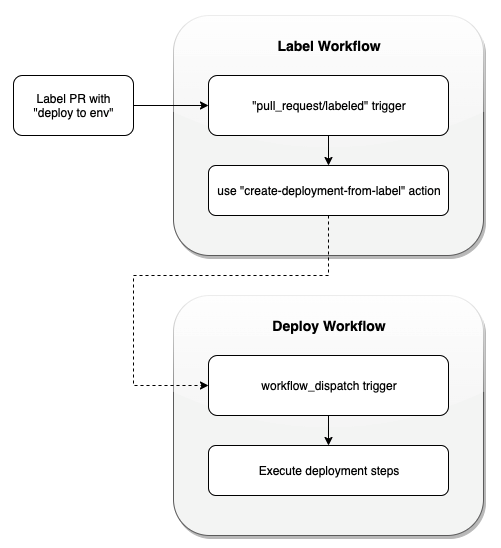

# Deployment Lifecylcle Actions

Managing deployments via PR is good practice and is a central tenet to GitHub flow. However, practically managing deployments is non-trivial. The Actions in this repo coupled with four workflow templates will give you a complete deployment management solution.

## Overview

The process is triggered by adding a `deploy to <environment>` label to the PR. Automation processes the label and triggers a deployment workflow with your deployment steps. This creates a deployment which you will see in the PR. Once the PR is closed, the deployment is marked as inactive and a destroy workflow is invoked to clean up resources.

The Actions in this repo wrap the heavy-lifting for you. There are four workflows involved:

Workflow|Trigger|Action Used|Parameters
--|--|--|--
`Label Deployment`|When a label is added to the PR|[colindembovsky/deployment-lifecycle-actions/create-deployment-from-label](colindembovsky/deployment-lifecycle-actions/create-deployment-from-label/action.yml)|<ul><li>The name of the deployment workflow</li><li>Deployment token</li></ul>
`Deployment`|Triggered by the `Label Deployment` workflow|_None_|_None_
`Deactivate Deployment`|When the PR is closed|[colindembovsky/deployment-lifecycle-actions/deactivate-deployment](deactivate-deployment/action.yml)|_None_
`Destroy Environment`|When a deployment is set to `failure`|[colindembovsky/deployment-lifecycle-actions/extract-deployment-info](colindembovsky/deployment-lifecycle-actions/extract-deployment-info/action.yml)|_None_

The deployment phase is as follows:

### Step 1: Label Deployment Workflow

1. A PR is created as usual.
1. When ready to deploy, someone adds a `deploy to <environment>` label to the PR to deploy to the `<enviroment>` environment
    
1. The `Label Deployment` workflow triggers when the label is added.
    - This workflow uses `colindembovsky/deployment-lifecycle-actions/create-deployment-from-label`
        - The Action first extracts the environment name (`dev` from `deploy to dev` for example) based on a customizable regex pattern
        - The Action then invokes the `Deployment workflow` passing in the `environment` and any other inputs
1. The `Deployment workflow` triggers.
    - This workflow performs your deployment steps in the environment
    - This automatically creates a `deployment` object that you will see in the PR

When the PR is closed, the proces is as follows:

## Workflows

