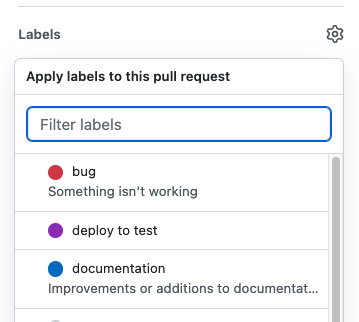

# Deployment Lifecylcle Actions

Managing deployments via PR is good practice and is a central tenet to GitHub flow. However, practically managing deployments is non-trivial. The Actions in this repo coupled with four workflow templates will give you a complete deployment management solution.

## Overview

The process is triggered by adding a `deploy to <environment>` label to the PR. Automation processes the label and triggers a deployment workflow with your deployment steps. This creates a deployment which you will see in the PR. Once the PR is closed, the deployment is marked as inactive and a destroy workflow is invoked to clean up resources.

The Actions in this repo wrap the heavy-lifting for you. There are four workflows involved:

Workflow|Trigger|Action Used|Parameters
--|--|--|--
`Label Deployment`|When a label is added to the PR|[colindembovsky/deployment-lifecycle-actions/create-deployment-from-label](colindembovsky/deployment-lifecycle-actions/create-deployment-from-label/action.yml)|<ul><li>The name of the deployment workflow</li><li>Deployment token</li></ul>
`Deployment`|Triggered by the `Label Deployment` workflow|_None_|_None_
`Deactivate Deployment`|When the PR is closed|[colindembovsky/deployment-lifecycle-actions/deactivate-deployment](deactivate-deployment/action.yml)|_None_
`Destroy Environment`|When a deployment is set to `failure`|[colindembovsky/deployment-lifecycle-actions/extract-deployment-info](colindembovsky/deployment-lifecycle-actions/extract-deployment-info/action.yml)|_None_

### Deployment Phase

The deployment works as follows:


1. A PR is created as usual.
1. When ready to deploy, someone adds a `deploy to <environment>` label to the PR to deploy to the `<enviroment>` environment:

    
    
1. The `Label Deployment` workflow triggers when the label is added.
    - This workflow uses `colindembovsky/deployment-lifecycle-actions/create-deployment-from-label`
        - The Action first extracts the environment name (`dev` from `deploy to dev` for example) based on a customizable regex pattern
        - The Action then invokes the `Deployment workflow` passing in the `environment` and any other inputs
1. The `Deployment` workflow triggers.
    - This workflow performs your deployment steps in the environment
    - This automatically creates a `deployment` object that you will see in the PR:
        
    - You will also see the deployment in the Environments page:
        

### Deployment Phase

When the PR is closed, the deactivate phase is as follows:


1. The PR close event triggers the `Deactivate Deployment` workflow.
    - This workflow uses `colindembovsky/deployment-lifecycle-actions/deactivate-deployment`
        - The Action first transitions the deployment to `failure` to trigger the next workflow due to [this limitation](https://docs.github.com/en/actions/using-workflows/events-that-trigger-workflows#deployment_status)
        - The Action then transitions the deployment to `inactive`

            

1. The `Destroy Environment` workflow triggers off the deployment status change.
    - This workflow uses `colindembovsky/deployment-lifecycle-actions/extract-deployment-info` to get the `ref` and `environment` and sets them as outputs
    - Your custom teardown steps are added after this
       
        

## The Workflows

### 1. Label Deployment Workflow

Use this to trigger the process. You need to know the name of the workflow you want to trigger and any additional inputs.

```yml
name: Label deployment trigger

# mandatory to trigger correctly
on:
  pull_request:
    types:
      - labeled

jobs:
  deployment:
    name: Create deployment
    runs-on: ubuntu-20.04
    # filter on the 'deploy to x' labels - customize for your environment names
    if: |
      github.event.label.name == 'deploy to test' ||
      github.event.label.name == 'deploy to staging' ||
      github.event.label.name == 'deploy to qa'
    
    steps:
    - name: Checkout Sources
      uses: actions/checkout@v3

    - name: Create deployment from label
      id: create-deploy
      uses: colindembovsky/deployment-lifecycle-actions/create-deployment-from-label
      with:
        # this is the name of the yml file in your .github/workflows/ folder that you want to trigger
        # to run the deployment steps. The workflow must expect at least 1 input called 'environment'
        deployment-workflow-name: TEST-2-DeployEnvironment.yml
        # optional: use a json format to pass additional inputs
        additional-inputs-json: '{ "url": "https://another-test-url" }'
        # provide a token with "workflow" permissions
        # GITHUB_TOKEN will not work since it cannot invoke workflows (prevent infinite loops)
        token: ${{ secrets.DEPLOY_TOKEN }}
    
    # access the outputs of the create-deployment-from-label step
    - name: Dump env name
      run: echo $ENV
      env:
         ENV: ${{ steps.create-deploy.outputs.environment }}
```

### 2. Deployment Workflow

You use this to run your deployment steps.

```yml
name: Deploy Environment

on:
  # this is triggered by the 'Label Deployment' workflow
  workflow_dispatch:
    inputs:
      # this is mandatory
      environment:
        description: The name of the environment to be deployed
        required: true
      # other inputs can be passed using 'additional-inputs-json' in the 'Label Deployment' workflow
      url:
        description: The URL of the environment
        required: false
        default: https://test

jobs:
  deploy:
    name: Deploy to Environment
    runs-on: ubuntu-20.04

    # mandatory to actually create a deployment object
    environment:
      # access the input values using ${{ github.event.inputs }}
      name: ${{ github.event.inputs.environment }}
      url: ${{ github.event.inputs.url }}

    # add your deployment steps here
    steps:
      - name: Deploy steps!
        run: echo "Deploying the app!"
```

### 3. Deactivate Deployment Workflow

No customization needed here - this simply marks the deployment in the PR as inactive, which triggers the `Destroy environment` workflow.

```yml
name: Deactivate Deployment

on:
  pull_request:
    types:
      - closed

jobs:
  clean:
    name: Cleanup Review environments
    runs-on: ubuntu-20.04

    steps:
    - name: Checkout
      uses: actions/checkout@v3

    - name: Mark environments as inactive in GitHub
      uses: colindembovsky/deployment-lifecycle-actions/deactivate-deployment
      with:
        token: ${{ secrets.DEPLOY_TOKEN }}
```

### 4. Destroy Environment Workflow

Use the `extract-deployment-info` action to extract the `ref` and `environment`. Then perform any applicable cleanup steps.

```yml
name: Destroy Environment

# mandatory
on:
  deployment_status

jobs:
  destroy:
    name: Destroy a deployment environment
    # mandatory to filter correctly - you don't want to run this on 'activate' for example
    if: github.event.deployment_status.state == 'failure'
    runs-on: ubuntu-20.04

    steps:
    - name: Checkout Sources
      uses: actions/checkout@v3

    # extract the 'ref' and 'environment' as outputs
    - name: Extract Deployment Details and Report Deployment in Progress
      id: deployment_data
      uses: colindembovsky/deployment-lifecycle-actions/extract-deployment-info
    
    # implement tear-down steps here, accessing the outputs from the previous step
    - name: Destroy environment
      run: |
        echo Environment name is $ENV_NAME
        echo Ref is $REF
      env:
        REF: ${{ steps.deployment_data.outputs.deployment_ref }}
        ENV_NAME: ${{ steps.deployment_data.outputs.environment }}
```